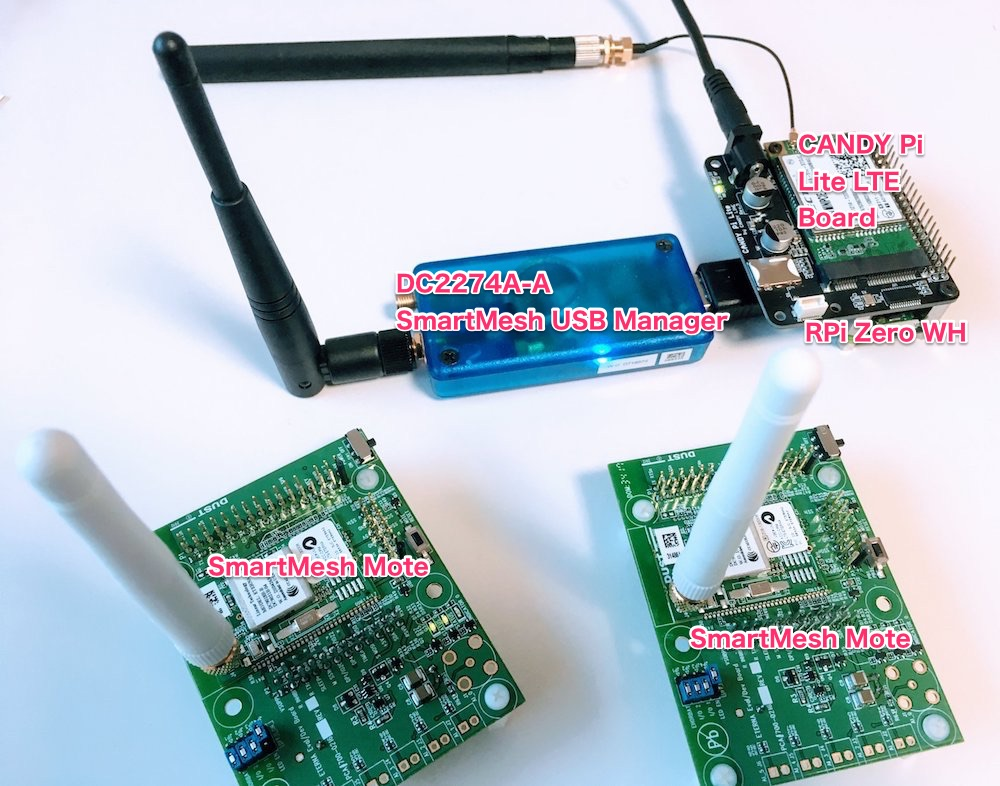
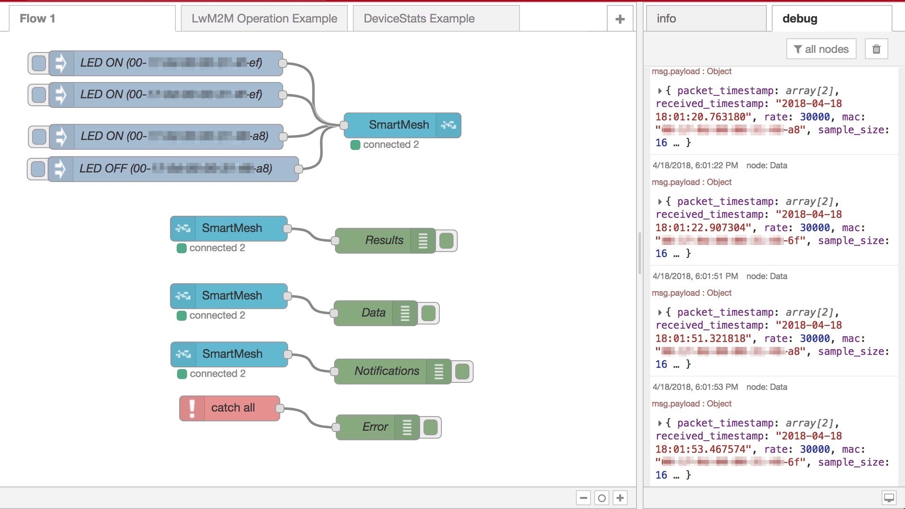
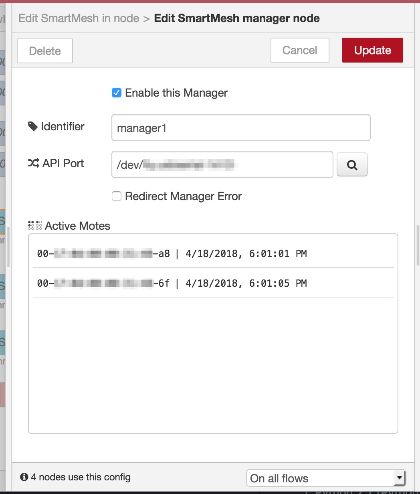

node-red-contrib-smartmesh
===

[](https://github.com/CANDY-LINE/node-red-contrib-smartmesh/releases/latest)
[](https://travis-ci.org/CANDY-LINE/node-red-contrib-smartmesh/)

Node-RED nodes for Analog Devices' [DC2274A-A SmartMesh IP™ USB Network Manager](http://www.analog.com/en/design-center/evaluation-hardware-and-software/evaluation-boards-kits/dc2274a-a.html).



The above picture shows a typical demonstration set including:

- DC2274A-A SmartMesh IP™ USB Manager dongle
- SmartMesh IP™ Motes containing controllable LED, temperature sensor and GPIO/UART/SPI/I2C interfaces
- Raspberry Pi Zero WH for running Node-RED/CANDY RED(a custom version of Node-RED dedicated to CANDY Pi Lite)
- CANDY Pi Lite LTE Board for 4G/LTE mobile connection to upload data/download control commands to/from cloud servers

## Example Flow

The bundled example flow includes the following operations:

- Turn on/off LED on remote motes
- Getting LED on/off command results
- Showing temperature data from remote motes
- Showing SmartMesh network event notifications



## Easy to use

These are provided by the default firmware on the evaluation kit. So you don't have to flash a specific firmware to work the example but just turn all motes on and connect the USB manager to Raspberry Pi, ASUS Tinker Board or other Linux box where Node-RED runs.

## Listing Active Motes

You can find the active (online) motes from the manager dialog while monitoring the flow.



## SmartMesh IP Document

See [SmartMesh IP™ Tools Guide(PDF)](http://cds.linear.com/docs/en/software-and-simulation/SmartMesh_IP_Tools_Guide.pdf) for SmartMesh IP™ technical details.

# Prerequisites

[SmartMesh SDK v1.3.0.1](https://dustcloud.atlassian.net/wiki/spaces/SMSDK/overview) ([GitHub repo](https://github.com/dustcloud/smartmeshsdk)) requires the following environments.

1. Python 2.7 (Python 2.6/3.x are NOT supported)
1. PySerial 3.4+

# How to install

For Windows users, use Docker or Linux box VM to start Node-RED in order to install this node.

## Node-RED users

Run the following commands:
```
sudo pip install pyserial
cd ~/.node-red
sudo npm install --unsafe-perm node-red-contrib-smartmesh
```

Then restart Node-RED process.

`sudo` is used for installing [SmartMesh SDK](https://dustcloud.atlassian.net/wiki/spaces/SMSDK/overview) into dist-package directory.

**Node-RED users cannot install this node via `Manage Palette` dialog because of insufficient permission unless the process is owned by privileged user. Use the above commands to install it.**

### Uninstallation

```
cd ~/.node-red
sudo npm uninstall --unsafe-perm node-red-contrib-smartmesh
```

## CANDY RED users

Use `Manage Palette` dialog in the browser editor or run the following commands:
```
sudo pip install pyserial
cd $(npm -g root)/candy-red
sudo npm install --unsafe-perm node-red-contrib-smartmesh
```

Then restart `candy-red` service.

```
sudo systemctl restart candy-red
```

### Uninstallation

`Manage Palette` dialog should work for uninstallation as well as the following commands:

```
cd $(npm -g root)/candy-red
sudo npm uninstall --unsafe-perm node-red-contrib-smartmesh
```

# Appendix

## How to build

```
# build
$ NODE_ENV=development npm run build
# package
$ NODE_ENV=development npm pack
```

### Shrinkwrap

```
$ rm -fr node_modules; \
  rm -f npm-shrinkwrap.json; \
  nodenv local 8.10.0; \
  npm install;npm run freeze
```

# Revision History

* 1.0.0
  - Initial General Availability Release
  - Add `node-red` keyword
  - Fix an issue where Active Motes were never shown in the manager dialog

* 0.3.1
  - Fix an issue where Object.value function was missing on Node.js v6

* 0.3.0
  - Add the mac property only when it's available
  - Fix an issue where some of events didn't contain the mac address
  - Show active motes on the manager dialog for better user experience
  - Add the connected mote counter to the connected status label
  - Add a new type 'Data' for subscription type

* 0.2.0
  - Fix an issue where /usr/local directory was removed when uninstalling this package
  - Add a new property to SmartMesh IP™ manager node to append a source manager identifier to the mote event message

* 0.1.0
  - Initial Release (alpha)
  - `node-red` keyword is not yet added
