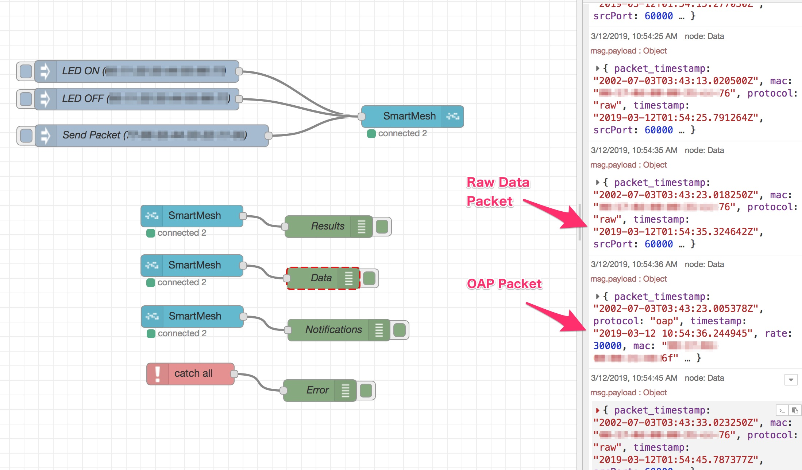

node-red-contrib-smartmesh
===

[](https://github.com/CANDY-LINE/node-red-contrib-smartmesh/releases/latest)
[](https://travis-ci.org/CANDY-LINE/node-red-contrib-smartmesh/)

Node-RED nodes for Analog Devices' [DC2274A-A SmartMesh IP™ USB Network Manager](http://www.analog.com/en/design-center/evaluation-hardware-and-software/evaluation-boards-kits/dc2274a-a.html).


The above picture shows a typical demonstration set including:

- DC2274A-A SmartMesh IP™ USB Manager dongle
- SmartMesh IP™ Motes containing controllable LED, temperature sensor and GPIO/UART/SPI/I2C interfaces
- Raspberry Pi Zero WH for running Node-RED/CANDY RED(a custom version of Node-RED dedicated to CANDY Pi Lite)
- CANDY Pi Lite LTE Board for 4G/LTE mobile connection to upload data/download control commands to/from cloud servers

## Example Flow

The bundled example flow includes the following operations:

- Turn on/off LED on remote motes
- Getting LED on/off command results
- Showing temperature data from remote motes
- Showing SmartMesh network event notifications



## Easy to use

These are provided by the default firmware on the evaluation kit. So you don't have to flash a specific firmware to work the example but just turn all motes on and connect the USB manager to Raspberry Pi, ASUS Tinker Board or other Linux box where Node-RED runs.

## Listing Active Motes

You can find the active (online) motes from the manager dialog while monitoring the flow.


## SmartMesh IP™ Document

See [SmartMesh IP™ Tools Guide(PDF)](http://cds.linear.com/docs/en/software-and-simulation/SmartMesh_IP_Tools_Guide.pdf) for SmartMesh IP™ technical details.

# Prerequisites

[SmartMesh SDK v1.3.0.1](https://dustcloud.atlassian.net/wiki/spaces/SMSDK/overview) ([GitHub repo](https://github.com/dustcloud/smartmeshsdk)) requires the following environments.

1. Python 2.7 (Python 2.6/3.x are NOT supported)
1. PySerial 3.4+

# How to install

For Windows users, use Docker or Linux box VM to start Node-RED in order to install this node.

# How to change Network ID

In order to change the current Network ID, run the following command manually with the SmartMesh IP Manager CLI. Note that you need to have all motes to join the current network so that the change takes effect to all the connecting motes as well as the IP Manager.

```
# Connect to the SmartMesh IP USB Manager CLI serial port
$ screen /dev/DC2274A-A.CLI 9600
> login user
> sm
MAC                MoteId  State Nbrs Links Joins    Age StateTime
00-11-22-00-00-11-22-33    1     Oper    2    22     1      0    0-00:17:57
00-11-22-00-00-11-22-44    2     Oper    2    10     1      4    0-00:16:09
00-11-22-00-00-11-22-55    3     Oper    2    10     1      5    0-00:16:13

Number of motes (max 101): Total 3, Live 3, Joining 0 Blink 0

# Assume that you're changing the Network ID to 1234.
> exec exchNetId 1234
Start Global Unicast Command exchNetId

# Restart a remote mote by providing MoteId (shown above list)
# You can turn it off then on rather than the following command.
> reset mote 2
> reset mote 3

# Restart the manager itself
> reset system

# Login again
> login user

# Show the renewed Network ID
> minfo

Net stack  1.4.1.10
state:     Oper
mac:       00:17:0d:00:00:58:62:55
moteid:    1
netid:     1234
blSwVer:   15
ldrSwVer:  0.0.0.0
board id/rev:0x7/0x7
UTC time:  1025666424.260 sec
reset st:  400
battery:   3295 mV
temp:      22 C
```

## Node-RED users

Run the following commands:
```
sudo pip install pyserial
cd ~/.node-red
sudo npm install --unsafe-perm node-red-contrib-smartmesh
```

Then restart Node-RED process.

`sudo` is used for installing [SmartMesh SDK](https://dustcloud.atlassian.net/wiki/spaces/SMSDK/overview) into dist-package directory.

**Node-RED users cannot install this node via `Manage Palette` dialog because of insufficient permission unless the process is owned by privileged user. Use the above commands to install it.**

### Uninstallation

The following command uninstalls SmartMesh SDK python executables/libraries as well as this node package.

```
cd ~/.node-red
sudo npm uninstall --unsafe-perm node-red-contrib-smartmesh
```

## CANDY RED users

Use `Manage Palette` dialog in the browser editor or run the following commands:
```
sudo pip install pyserial
cd /opt/candy-red/.node-red
sudo npm install --unsafe-perm node-red-contrib-smartmesh
```

Then restart `candy-red` service.

```
sudo systemctl restart candy-red
```

### Uninstallation

`Manage Palette` dialog should work for uninstallation as well as the following commands:

```
cd /opt/candy-red/.node-red
sudo npm uninstall --unsafe-perm node-red-contrib-smartmesh
```

The above command uninstalls SmartMesh SDK python executables/libraries as well as this node package.

# Appendix

## How to build

```
# build
$ NODE_ENV=development npm run build
# package
$ NODE_ENV=development npm pack
```

# Revision History
* 1.1.0
  - Remove shrinkwrap file
  - Fix an issue where an error was swallowed on receiving 'close' event

* 1.0.1
  - Update README
  - Remove .pyc files on running `clean` task

* 1.0.0
  - Initial General Availability Release
  - Add `node-red` keyword
  - Fix an issue where Active Motes were never shown in the manager dialog

* 0.3.1
  - Fix an issue where Object.value function was missing on Node.js v6

* 0.3.0
  - Add the mac property only when it's available
  - Fix an issue where some of events didn't contain the mac address
  - Show active motes on the manager dialog for better user experience
  - Add the connected mote counter to the connected status label
  - Add a new type 'Data' for subscription type

* 0.2.0
  - Fix an issue where /usr/local directory was removed when uninstalling this package
  - Add a new property to SmartMesh IP™ manager node to append a source manager identifier to the mote event message

* 0.1.0
  - Initial Release (alpha)
  - `node-red` keyword is not yet added
